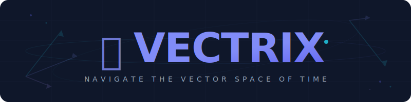

<div align="center">

<br>

<picture>
  <source media="(prefers-color-scheme: dark)" srcset=".github/assets/logo.svg">
  <source media="(prefers-color-scheme: light)" srcset=".github/assets/logo.svg">
  
</picture>

<br>

<h3>순수 Python 시계열 예측 엔진</h3>

<p>


</p>

<p>
<a href="https://pypi.org/project/vectrix/"></a>
<a href="https://pypi.org/project/vectrix/"></a>
<a href="LICENSE"></a>

</p>

<br>

<p>
<a href="#-빠른-시작">빠른 시작</a> ·
<a href="#-모델">모델</a> ·
<a href="#-설치">설치</a> ·
<a href="#-사용-예시">사용 예시</a> ·
<a href="#-api-레퍼런스">API</a> ·
<a href="README.md">English</a>
</p>

</div>

<br>

<div align="center">
<picture>
  
</picture>
</div>

<br>

## ◈ 빠른 시작

```bash
pip install vectrix
```

```python
from vectrix import forecast

result = forecast("sales.csv", steps=12)
print(result)
result.plot()
```

> 한 줄이면 모델 선택, 일직선 예측 방지, 신뢰구간까지 포함된 예측이 완성됩니다.

<br>

## ◈ 왜 Vectrix?

<table>
<tr>
<td>

| 차원 | Vectrix | statsforecast | Prophet | Darts |
|:--|:--:|:--:|:--:|:--:|
| **Zero-config** | ✅ | ✅ | ❌ | ❌ |
| **순수 Python** | ✅ | ❌ | ❌ | ❌ |
| **30+ 모델** | ✅ | ✅ | ❌ | ✅ |
| **평탄 예측 방어** | ✅ | ❌ | ❌ | ❌ |
| **스트레스 테스트** | ✅ | ❌ | ❌ | ❌ |
| **Forecast DNA** | ✅ | ❌ | ❌ | ❌ |
| **제약 조건 (8종)** | ✅ | ❌ | ❌ | ❌ |
| **R 스타일 회귀** | ✅ | ❌ | ❌ | ❌ |

</td>
</tr>
</table>

> **벡터 3개.** `numpy` · `scipy` · `pandas` — 그것이 전체 궤도입니다.

<br>

## ◈ 모델

<details open>
<summary><b>핵심 예측 모델</b></summary>

<br>

| 모델 | 설명 |
|:-----|:-----|
| **AutoETS** | 30개 ExT×S 조합, AICc 자동 선택 |
| **AutoARIMA** | 계절성 ARIMA, 단계적 차수 선택 |
| **Theta / DOT** | Original + Dynamic Optimized Theta |
| **AutoCES** | Complex Exponential Smoothing |
| **AutoTBATS** | 삼각함수 다중 계절성 분해 |
| **GARCH** | GARCH, EGARCH, GJR-GARCH 변동성 |
| **Croston** | Classic, SBA, TSB 간헐적 수요 |
| **Logistic Growth** | 용량 제한 포화 추세 |
| **AutoMSTL** | 다중 계절성 STL + ARIMA 잔차 |
| **베이스라인** | Naive, Seasonal, Mean, Drift, Window Average |

</details>

<details>
<summary><b>세계 최초 방법론 — 미지의 영역</b></summary>

<br>

| 방법 | 설명 |
|:-----|:-----|
| **Lotka-Volterra Ensemble** | 생태계 역학 기반 모델 가중치 |
| **Phase Transition** | 임계 둔화 → 레짐 전환 예측 |
| **Adversarial Stress** | 5가지 섭동 연산자 |
| **Hawkes Demand** | 자기 흥분 점 과정 |
| **Entropic Confidence** | Shannon 엔트로피 정량화 |

</details>

<details>
<summary><b>적응형 지능</b></summary>

<br>

| 시스템 | 설명 |
|:-------|:-----|
| **레짐 감지** | 순수 numpy HMM (Baum-Welch + Viterbi) |
| **자가 치유** | CUSUM + EWMA 드리프트 → 컨포멀 보정 |
| **제약 조건** | 8종: ≥0, 범위, 용량, YoY, Σ, ↑↓, 비율, 커스텀 |
| **Forecast DNA** | 65+ 특성 → 메타러닝 모델 추천 |
| **평탄 방어** | 4단계 방지 시스템 |

</details>

<details>
<summary><b>회귀분석 & 진단</b></summary>

<br>

| 기능 | 설명 |
|:-----|:-----|
| **방법** | OLS, Ridge, Lasso, Huber, Quantile |
| **수식** | R 스타일: `regress(data=df, formula="y ~ x")` |
| **진단** | Durbin-Watson, Breusch-Pagan, VIF, 정규성 |
| **변수 선택** | Stepwise, 정규화 CV, 최적 부분집합 |
| **시계열** | Newey-West, Cochrane-Orcutt, Granger |

</details>

<details>
<summary><b>비즈니스 인텔리전스</b></summary>

<br>

| 모듈 | 설명 |
|:-----|:-----|
| **이상치 탐지** | 자동 이상값 식별 및 설명 |
| **What-if** | 시나리오 기반 예측 시뮬레이션 |
| **백테스팅** | Rolling origin 교차 검증 |
| **계층 조정** | Bottom-up, Top-down, MinTrace |
| **예측 구간** | Conformal + Bootstrap |

</details>

<br>

## ◈ 설치

```bash
pip install vectrix                # 핵심 (numpy + scipy + pandas)
pip install "vectrix[numba]"       # + Numba JIT (2-5배 가속)
pip install "vectrix[ml]"          # + LightGBM, XGBoost, scikit-learn
pip install "vectrix[all]"         # 전체
```

<br>

## ◈ 사용 예시

### Easy API

```python
from vectrix import forecast, analyze, regress

result = forecast([100, 120, 115, 130, 125, 140], steps=5)

report = analyze(df, date="date", value="sales")
print(f"난이도: {report.dna.difficulty}")

model = regress(data=df, formula="sales ~ temperature + promotion")
print(model.summary())
```

### DataFrame 워크플로우

```python
from vectrix import forecast, analyze
import pandas as pd

df = pd.read_csv("data.csv")

report = analyze(df, date="date", value="sales")
print(report.summary())

result = forecast(df, date="date", value="sales", steps=30)
result.plot()
result.to_csv("forecast.csv")
```

### 엔진 직접 접근

```python
from vectrix.engine import AutoETS, AutoARIMA
from vectrix.adaptive import ForecastDNA

ets = AutoETS(period=7)
ets.fit(data)
pred, lower, upper = ets.predict(30)

dna = ForecastDNA()
profile = dna.analyze(data, period=7)
print(f"난이도: {profile.difficulty}")
print(f"추천: {profile.recommendedModels}")
```

<br>

## ◈ API 레퍼런스

### Easy API (권장)

| 함수 | 설명 |
|:-----|:-----|
| `forecast(data, steps=30)` | 자동 모델 선택 예측 |
| `analyze(data)` | DNA 프로파일링, 변환점, 이상치 |
| `regress(y, X)` / `regress(data=df, formula="y ~ x")` | 진단 포함 회귀분석 |
| `quick_report(data, steps=30)` | 분석 + 예측 통합 |

### Classic API

| 메서드 | 설명 |
|:-------|:-----|
| `Vectrix().forecast(df, dateCol, valueCol, steps)` | 전체 파이프라인 |
| `Vectrix().analyze(df, dateCol, valueCol)` | 데이터 분석 |

<br>

## ◈ 후원

Vectrix가 유용하다면 미션을 지원해주세요:

<a href="https://buymeacoffee.com/eddmpython">
  
</a>

<br><br>

## ◈ 라이선스

[MIT](LICENSE) — 개인 및 상업 프로젝트에서 자유롭게 사용 가능합니다.

<br>

<div align="center">

*데이터의 미지 차원을 탐색합니다.*

</div>
